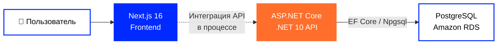

[🇬🇧 English](https://github.com/tr3ba/.github/blob/main/profile/README.md) ·
[🇺🇦 Українська](https://github.com/tr3ba/.github/blob/main/profile/README.uk.md) ·
**🇷🇺 Русский**

  

# 🛒 Treba Marketplace

### Маркетплейс · Облачная инфраструктура · DevOps

Современная платформа маркетплейса с особым акцентом на  
**облачную инфраструктуру, автоматизацию, безопасность, мониторинг и надежность**.

 

  

---

## 👋 О Treba

**Treba** — командный full-stack маркетплейс, состоящий из современного веб-интерфейса,
структурированного backend API и облачной инфраструктуры в AWS.

Backend содержит API маркетплейса, аутентификацию, авторизацию, управление пользователями,
операции с каталогом и доступ к базе данных.

Frontend отвечает за интерфейс маркетплейса и сейчас активно интегрируется
с backend API.

Инфраструктурная часть обеспечивает контейнеризированное развертывание, автоматизированную доставку,
мониторинг, восстановление базы данных, контроль доступа и усиление безопасности.

---

# 🧩 Основные технологии

<table width="100%">
<tr>

<td width="50%" valign="top">

### 🎨 Frontend

 

**Next.js 16.2.12**  
Основной frontend-фреймворк.

  

**React 19.2.4**  
Библиотека для построения пользовательского интерфейса.

  

**TypeScript 5.x**  
Основной язык frontend-части.

 

</td>

<td width="50%" valign="top">

### ⚙️ Backend

 

**ASP.NET Core · .NET 10**  
Backend API и основная платформа выполнения.

  

**Entity Framework Core 10**  
ORM, модели базы данных и миграции.

  

**Npgsql 10.0.3**  
PostgreSQL-провайдер для Entity Framework Core.

 

</td>

</tr>
</table>

---

# 💻 Языки репозиториев

<table width="100%">
<tr>

<td width="50%" valign="top" align="center">

### ⚙️ Backend

C# backend с дополнительными HTML/CSS файлами, включая AdminPanel.

</td>

<td width="50%" valign="top" align="center">

### 🎨 Frontend

Next.js приложение, написанное преимущественно на TypeScript и CSS.

</td>

</tr>
</table>

---

# 🗄️ Уровень данных

<table width="100%">
<tr>

<td width="50%" align="center" valign="top">

### PostgreSQL

Основная реляционная база данных backend-части.

Доступ к базе реализован через  
**Entity Framework Core + Npgsql**.

</td>

<td width="50%" align="center" valign="top">

### Amazon RDS

Управляемая PostgreSQL-среда в AWS,
используемая инфраструктурой Treba.

</td>

</tr>
</table>

---

# ☁️ AWS & DevOps

## 🚀 Доставка и Runtime

<table width="100%">
<tr>

<td width="25%" align="center" valign="top">

### Docker

Контейнеризация backend и frontend сервисов.

</td>

<td width="25%" align="center" valign="top">

### GitHub Actions

Автоматизация сборки, тестов и доставки.

</td>

<td width="25%" align="center" valign="top">

### Amazon ECR

Реестр Docker-образов приложения.

</td>

<td width="25%" align="center" valign="top">

### Amazon EC2

Сервер выполнения развернутых контейнеров приложения.

</td>

</tr>
</table>

 

## 🛡️ Операции и инфраструктура

<table width="100%">
<tr>

<td width="25%" align="center" valign="top">

### Systems Manager

Удаленное развертывание и выполнение команд.

</td>

<td width="25%" align="center" valign="top">

### CloudWatch

Мониторинг инфраструктуры и alarms.

</td>

<td width="25%" align="center" valign="top">

### IAM

Контроль доступа для автоматизации и runtime-сервисов.

</td>

<td width="25%" align="center" valign="top">

### Secrets Manager

Контролируемый доступ к runtime-секретам.

</td>

</tr>
</table>

---

# 🏗️ Архитектура системы

Treba состоит из отдельных уровней **frontend**, **backend API** и **базы данных**.

Backend API и PostgreSQL-уровень реализованы отдельно от frontend.

> **Статус frontend-интеграции:** сценарии каталога, аутентификации и корзины
> все еще содержат локальные client-side данные/состояние и постепенно подключаются к backend API.

---

# 🚀 CI/CD Pipeline

```mermaid
flowchart LR

    DEV["Разработчик"]
    GH["GitHub"]
    ACTIONS["GitHub<br/>Actions"]
    TEST["Build<br/>& Tests"]
    DOCKER["Docker<br/>Image"]
    ECR["Amazon<br/>ECR"]
    SSM["AWS Systems<br/>Manager"]
    EC2["Amazon<br/>EC2"]

    DEV --> GH
    GH --> ACTIONS
    ACTIONS --> TEST
    TEST --> DOCKER
    DOCKER --> ECR
    ECR --> SSM
    SSM --> EC2

    style DEV fill:#ffffff,color:#000000,stroke:#002AFF,stroke-width:2px
    style GH fill:#ffffff,color:#000000,stroke:#002AFF,stroke-width:2px
    style ACTIONS fill:#002AFF,color:#ffffff,stroke:#002AFF,stroke-width:2px
    style TEST fill:#002AFF,color:#ffffff,stroke:#002AFF,stroke-width:2px
    style DOCKER fill:#002AFF,color:#ffffff,stroke:#002AFF,stroke-width:2px
    style ECR fill:#FF6E2A,color:#ffffff,stroke:#FF6E2A,stroke-width:2px
    style SSM fill:#FF6E2A,color:#ffffff,stroke:#FF6E2A,stroke-width:2px
    style EC2 fill:#FF6E2A,color:#ffffff,stroke:#FF6E2A,stroke-width:2px
```

**GitHub → GitHub Actions → Build & Test → Docker → ECR → SSM → EC2**

В репозиториях настроены CI/CD workflows для сборки, тестирования,
создания Docker-образов, публикации в Amazon ECR и развертывания через AWS Systems Manager.

**Backend**

- restore и build
- автоматизированные тесты
- проверка уязвимостей NuGet
- Docker image build
- `/ping` smoke check контейнера
- публикация образов в ECR
- SSM-based deployment на EC2
- versioned `v*` release workflow

**Frontend**

- Docker image build
- публикация в ECR
- SSM-based deployment на EC2

---

# 🕓 История развития

<table width="100%">

<tr>
<td width="22%" align="center">

### 🌱 Июль

**Основа**

</td>

<td>

Созданы GitHub organization, репозитории, структура веток и первый командный workflow.

`GitHub` · `Branches` · `Pull Requests` · `Review`

</td>
</tr>

<tr>
<td width="22%" align="center">

### 🐳 Август

**Контейнеры**

</td>

<td>

Проект перешел к воспроизводимым контейнеризированным средам и автоматизированным workflow.

`Docker` · `Docker Compose` · `GitHub Actions` · `CI/CD`

</td>
</tr>

<tr>
<td width="22%" align="center">

### ☁️ Сентябрь

**AWS**

</td>

<td>

Backend и frontend получили отдельные пути облачной доставки, а приложение было перенесено в AWS.

`ECR` · `EC2` · `RDS` · `Systems Manager`

</td>
</tr>

<tr>
<td width="22%" align="center">

### 🛡️ Октябрь

**Эксплуатация**

</td>

<td>

Фокус расширился от deployment к мониторингу, восстановлению,
безопасности инфраструктуры и более глубокому integration testing.

`CloudWatch` · `IAM` · `Backups` · `Security`

</td>
</tr>

</table>

---

# 📊 Мониторинг и восстановление

Последние задокументированные проверки инфраструктуры:
конец сентября — начало октября 2026 года.

<table width="100%">

<tr>

<td align="center" width="33%">

### 📈 CloudWatch

**6 infrastructure alarms**

Проверены во время последнего monitoring-аудита.

</td>

<td align="center" width="33%">

### 💾 Автоматические резервные копии

**7 дней хранения**

Автоматические Amazon RDS backups.

</td>

<td align="center" width="33%">

### ⏱️ PITR

**Point-in-Time Recovery**

Восстановление базы до выбранного момента времени.

</td>

</tr>

<tr>

<td align="center">

### 📸 Manual Snapshot

**Available**

Создана и проверена ручная точка восстановления.

</td>

<td align="center">

### 💰 AWS Budget

**Alerts configured**

Контроль расходов DEV-среды.

</td>

<td align="center">

### 🗄️ RDS Health

**Database connected**

Backend `/health` подтвердил соединение с базой.

</td>

</tr>

</table>

> Наличие backup и реально протестированное восстановление — разные вещи.
> Полный restore drill остается отдельной задачей.

---

# 🔐 Безопасность и инфраструктура

<table width="100%">

<tr>

<td width="50%" valign="top">

### 🛡️ Сетевая безопасность

- EC2 → RDS Security Group access
- удалено world-open правило PostgreSQL `5432`
- после hardening проверен доступ backend к RDS
- проверены фактические EC2 listeners
- доступ к базе сужен после временной диагностики

</td>

<td width="50%" valign="top">

### 🔑 Доступ и секреты

- IAM roles для AWS runtime
- scoped Secrets Manager access
- runtime env-файл ограничен правами `600`
- права GitHub CI и EC2 runtime разделены
- AWS Systems Manager используется для deployment

</td>

</tr>

<tr>

<td width="50%" valign="top">

### 🔄 Безопасность доставки

- GitHub Actions checks
- история Docker-образов в ECR
- SHA/version image tags
- SSM-based deployment
- проверка backend зависимостей на уязвимости

</td>

<td width="50%" valign="top">

### 🚧 Открытые задачи hardening

- HTTPS / TLS
- публичный backend port `5000`
- GitHub Actions → AWS OIDC
- immutable deployment по digest / SHA
- протестированный rollback
- централизованные application logs

</td>

</tr>

</table>

---

# 📦 Репозитории Treba

<table width="100%">
<tr>

<td width="50%" align="center" valign="top">

## ⚙️ Backend

### ASP.NET Core · .NET 10

Структурированное backend-решение:

`Application` · `Contracts` · `Domain` · `Infrastructure` · `WebApi` · `AdminPanel`

 

Содержит API для каталога, товаров, категорий, брендов, вариантов,
корзины, продавцов, магазинов, пользователей и административных функций.

  

Аутентификация включает регистрацию, login,
refresh/logout и поддержку двухфакторной аутентификации.

  

  

  

</td>

<td width="50%" align="center" valign="top">

## 🎨 Frontend

### Next.js 16 · React 19

Современный интерфейс маркетплейса, написанный преимущественно на TypeScript.

 

Содержит UI каталога, навигацию, представление товаров,
интерфейс аутентификации и функциональность корзины.

  

Интеграция backend API для каталога, аутентификации и корзины
еще находится в разработке.

  

  

  

</td>

</tr>
</table>

---

# Treba Marketplace

### Build · Automate · Deploy · Monitor · Improve

 

  

**Treba © 2026**

