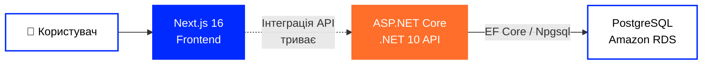

[🇬🇧 English](https://github.com/tr3ba/.github/blob/main/profile/README.md) ·
**🇺🇦 Українська** ·
[🇷🇺 Русский](https://github.com/tr3ba/.github/blob/main/profile/README.ru.md)

  

# 🛒 Treba Marketplace

### Маркетплейс · Хмарна інфраструктура · DevOps

Сучасна платформа маркетплейсу з особливим фокусом на  
**хмарній інфраструктурі, автоматизації, безпеці, моніторингу та надійності**.

 

  

---

## 👋 Про Treba

**Treba** — командний full-stack маркетплейс, що складається із сучасного вебінтерфейсу,
структурованого backend API та хмарної інфраструктури в AWS.

Backend містить API маркетплейсу, автентифікацію, авторизацію, керування користувачами,
операції з каталогом і доступ до бази даних.

Frontend відповідає за інтерфейс маркетплейсу та зараз активно інтегрується
з backend API.

Інфраструктурна частина забезпечує контейнеризоване розгортання, автоматизовану доставку,
моніторинг, відновлення бази даних, контроль доступу та посилення безпеки.

---

# 🧩 Основні технології

<table width="100%">
<tr>

<td width="50%" valign="top">

### 🎨 Frontend

 

**Next.js 16.2.12**  
Основний frontend-фреймворк.

  

**React 19.2.4**  
Бібліотека для побудови користувацького інтерфейсу.

  

**TypeScript 5.x**  
Основна мова frontend-частини.

 

</td>

<td width="50%" valign="top">

### ⚙️ Backend

 

**ASP.NET Core · .NET 10**  
Backend API та основна платформа виконання.

  

**Entity Framework Core 10**  
ORM, моделі бази даних та міграції.

  

**Npgsql 10.0.3**  
PostgreSQL-провайдер для Entity Framework Core.

 

</td>

</tr>
</table>

---

# 💻 Мови репозиторіїв

<table width="100%">
<tr>

<td width="50%" valign="top" align="center">

### ⚙️ Backend

C# backend із додатковими HTML/CSS файлами, зокрема в AdminPanel.

</td>

<td width="50%" valign="top" align="center">

### 🎨 Frontend

Next.js застосунок, написаний переважно на TypeScript та CSS.

</td>

</tr>
</table>

---

# 🗄️ Рівень даних

<table width="100%">
<tr>

<td width="50%" align="center" valign="top">

### PostgreSQL

Основна реляційна база даних backend-частини.

Доступ до бази реалізовано через  
**Entity Framework Core + Npgsql**.

</td>

<td width="50%" align="center" valign="top">

### Amazon RDS

Кероване PostgreSQL-середовище в AWS,
яке використовується інфраструктурою Treba.

</td>

</tr>
</table>

---

# ☁️ AWS & DevOps

## 🚀 Доставка та Runtime

<table width="100%">
<tr>

<td width="25%" align="center" valign="top">

### Docker

Контейнеризація backend і frontend сервісів.

</td>

<td width="25%" align="center" valign="top">

### GitHub Actions

Автоматизація збірки, тестів і доставки.

</td>

<td width="25%" align="center" valign="top">

### Amazon ECR

Реєстр Docker-образів застосунку.

</td>

<td width="25%" align="center" valign="top">

### Amazon EC2

Сервер виконання розгорнутих контейнерів застосунку.

</td>

</tr>
</table>

 

## 🛡️ Операції та інфраструктура

<table width="100%">
<tr>

<td width="25%" align="center" valign="top">

### Systems Manager

Віддалене розгортання та виконання команд.

</td>

<td width="25%" align="center" valign="top">

### CloudWatch

Моніторинг інфраструктури та alarms.

</td>

<td width="25%" align="center" valign="top">

### IAM

Контроль доступу для автоматизації та runtime-сервісів.

</td>

<td width="25%" align="center" valign="top">

### Secrets Manager

Контрольований доступ до runtime-секретів.

</td>

</tr>
</table>

---

# 🏗️ Архітектура системи

Treba складається з окремих рівнів **frontend**, **backend API** та **бази даних**.

Backend API та PostgreSQL-рівень реалізовані окремо від frontend.

> **Статус frontend-інтеграції:** сценарії каталогу, автентифікації та кошика
> все ще містять локальні client-side дані/стан і поступово підключаються до backend API.

---

# 🚀 CI/CD Pipeline

```mermaid
flowchart LR

    DEV["Розробник"]
    GH["GitHub"]
    ACTIONS["GitHub<br/>Actions"]
    TEST["Build<br/>& Tests"]
    DOCKER["Docker<br/>Image"]
    ECR["Amazon<br/>ECR"]
    SSM["AWS Systems<br/>Manager"]
    EC2["Amazon<br/>EC2"]

    DEV --> GH
    GH --> ACTIONS
    ACTIONS --> TEST
    TEST --> DOCKER
    DOCKER --> ECR
    ECR --> SSM
    SSM --> EC2

    style DEV fill:#ffffff,color:#000000,stroke:#002AFF,stroke-width:2px
    style GH fill:#ffffff,color:#000000,stroke:#002AFF,stroke-width:2px
    style ACTIONS fill:#002AFF,color:#ffffff,stroke:#002AFF,stroke-width:2px
    style TEST fill:#002AFF,color:#ffffff,stroke:#002AFF,stroke-width:2px
    style DOCKER fill:#002AFF,color:#ffffff,stroke:#002AFF,stroke-width:2px
    style ECR fill:#FF6E2A,color:#ffffff,stroke:#FF6E2A,stroke-width:2px
    style SSM fill:#FF6E2A,color:#ffffff,stroke:#FF6E2A,stroke-width:2px
    style EC2 fill:#FF6E2A,color:#ffffff,stroke:#FF6E2A,stroke-width:2px
```

**GitHub → GitHub Actions → Build & Test → Docker → ECR → SSM → EC2**

У репозиторіях налаштовані CI/CD workflows для збірки, тестування,
створення Docker-образів, публікації в Amazon ECR та розгортання через AWS Systems Manager.

**Backend**

- restore та build
- автоматизовані тести
- перевірка вразливостей NuGet
- Docker image build
- `/ping` smoke check контейнера
- публікація образів у ECR
- SSM-based deployment на EC2
- versioned `v*` release workflow

**Frontend**

- Docker image build
- публікація в ECR
- SSM-based deployment на EC2

---

# 🕓 Історія розвитку

<table width="100%">

<tr>
<td width="22%" align="center">

### 🌱 Липень

**Основа**

</td>

<td>

Створено GitHub organization, репозиторії, структуру гілок та перший командний workflow.

`GitHub` · `Branches` · `Pull Requests` · `Review`

</td>
</tr>

<tr>
<td width="22%" align="center">

### 🐳 Серпень

**Контейнери**

</td>

<td>

Проєкт перейшов до відтворюваних контейнеризованих середовищ та автоматизованих workflow.

`Docker` · `Docker Compose` · `GitHub Actions` · `CI/CD`

</td>
</tr>

<tr>
<td width="22%" align="center">

### ☁️ Вересень

**AWS**

</td>

<td>

Backend і frontend отримали окремі шляхи хмарної доставки, а застосунок був перенесений в AWS.

`ECR` · `EC2` · `RDS` · `Systems Manager`

</td>
</tr>

<tr>
<td width="22%" align="center">

### 🛡️ Жовтень

**Експлуатація**

</td>

<td>

Фокус розширився від deployment до моніторингу, відновлення,
безпеки інфраструктури та глибшого integration testing.

`CloudWatch` · `IAM` · `Backups` · `Security`

</td>
</tr>

</table>

---

# 📊 Моніторинг та відновлення

Останні задокументовані перевірки інфраструктури:
кінець вересня — початок жовтня 2026 року.

<table width="100%">

<tr>

<td align="center" width="33%">

### 📈 CloudWatch

**6 infrastructure alarms**

Перевірені під час останнього monitoring-аудиту.

</td>

<td align="center" width="33%">

### 💾 Автоматичні резервні копії

**7 днів зберігання**

Автоматичні Amazon RDS backups.

</td>

<td align="center" width="33%">

### ⏱️ PITR

**Point-in-Time Recovery**

Відновлення бази до вибраного моменту часу.

</td>

</tr>

<tr>

<td align="center">

### 📸 Manual Snapshot

**Available**

Створена та перевірена ручна точка відновлення.

</td>

<td align="center">

### 💰 AWS Budget

**Alerts configured**

Контроль витрат DEV-середовища.

</td>

<td align="center">

### 🗄️ RDS Health

**Database connected**

Backend `/health` підтвердив зв'язок із базою.

</td>

</tr>

</table>

> Наявність backup і фактично протестоване відновлення — різні речі.
> Повний restore drill залишається окремим завданням.

---

# 🔐 Безпека та інфраструктура

<table width="100%">

<tr>

<td width="50%" valign="top">

### 🛡️ Мережева безпека

- EC2 → RDS Security Group access
- прибрано world-open PostgreSQL `5432`
- після hardening перевірено доступ backend до RDS
- перевірені фактичні EC2 listeners
- доступ до бази звужений після тимчасової діагностики

</td>

<td width="50%" valign="top">

### 🔑 Доступ та секрети

- IAM roles для AWS runtime
- scoped Secrets Manager access
- runtime env-файл обмежений правами `600`
- права GitHub CI та EC2 runtime розділені
- AWS Systems Manager використовується для deployment

</td>

</tr>

<tr>

<td width="50%" valign="top">

### 🔄 Безпека доставки

- GitHub Actions checks
- історія Docker-образів в ECR
- SHA/version image tags
- SSM-based deployment
- перевірка backend залежностей на вразливості

</td>

<td width="50%" valign="top">

### 🚧 Відкриті задачі hardening

- HTTPS / TLS
- публічний backend port `5000`
- GitHub Actions → AWS OIDC
- immutable deployment за digest / SHA
- перевірений rollback
- централізовані application logs

</td>

</tr>

</table>

---

# 📦 Репозиторії Treba

<table width="100%">
<tr>

<td width="50%" align="center" valign="top">

## ⚙️ Backend

### ASP.NET Core · .NET 10

Структуроване backend-рішення:

`Application` · `Contracts` · `Domain` · `Infrastructure` · `WebApi` · `AdminPanel`

 

Містить API для каталогу, товарів, категорій, брендів, варіантів,
кошика, продавців, магазинів, користувачів та адміністративних функцій.

  

Автентифікація включає реєстрацію, login,
refresh/logout та підтримку двофакторної автентифікації.

  

  

  

</td>

<td width="50%" align="center" valign="top">

## 🎨 Frontend

### Next.js 16 · React 19

Сучасний інтерфейс маркетплейсу, написаний переважно на TypeScript.

 

Містить UI каталогу, навігацію, представлення товарів,
інтерфейс автентифікації та функціональність кошика.

  

Інтеграція backend API для каталогу, автентифікації та кошика
ще перебуває в розробці.

  

  

  

</td>

</tr>
</table>

---

# Treba Marketplace

### Build · Automate · Deploy · Monitor · Improve

 

  

**Treba © 2026**

