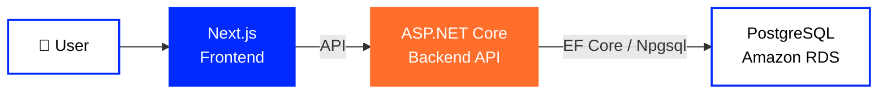

**🇬🇧 English** ·
[🇺🇦 Українська](https://github.com/tr3ba/.github/blob/main/profile/README.uk.md) ·
[🇷🇺 Русский](https://github.com/tr3ba/.github/blob/main/profile/README.ru.md)

  

# 🛒 Treba Marketplace

### Marketplace · Cloud Infrastructure · DevOps

A modern marketplace platform built with a strong focus on  
**cloud infrastructure, automation, security, monitoring and reliability**.

 

  

---

## 👋 About Treba

**Treba** is a modern full-stack marketplace built as a team project.

The platform combines a **Next.js frontend**, an **ASP.NET Core backend** and a
**PostgreSQL database**, supported by a real AWS cloud environment.

The engineering side of Treba goes beyond application development. The project includes
containerized deployment, automated CI/CD, cloud infrastructure, monitoring,
database recovery, access control and infrastructure security.

---

# 🧩 Core Technologies

<table>
<tr>

<td width="50%" valign="top" align="center">

<h2>🎨 Frontend</h2>

 

<strong>Next.js</strong> 
Main frontend framework powering the Treba web interface.

  

<strong>React</strong> 
Component-based architecture for the marketplace interface.

  

<strong>TypeScript</strong> 
Typed frontend development for safer and more maintainable code.

  

</td>

<td width="50%" valign="top" align="center">

<h2>⚙️ Backend</h2>

 

<strong>ASP.NET Core</strong> 
Main backend framework used for the Treba API and application services.

  

<strong>.NET 8</strong> 
Runtime and development platform for backend services.

  

<strong>Entity Framework Core</strong> 
Database access, models and migrations for the backend.

  

</td>

</tr>
</table>

---

# 🗄️ Data Layer

<table>
<tr>

<td width="50%" align="center" valign="top">

### PostgreSQL

Primary relational database used by the marketplace backend.

</td>

<td width="50%" align="center" valign="top">

### Amazon RDS

Managed AWS database environment hosting PostgreSQL.

</td>

</tr>
</table>

---

# ☁️ AWS & DevOps

<table>
<tr>

<td width="50%" valign="top" align="center">

## 🚀 Delivery & Runtime

  

### Docker

Containerized packaging for backend and frontend services.

 

### GitHub Actions

Automated build, delivery and deployment workflows.

 

### Amazon ECR

Container registry storing Treba backend and frontend Docker images.

 

### Amazon EC2

Cloud server running the deployed application containers.

 

</td>

<td width="50%" valign="top" align="center">

## 🛡️ Operations & Infrastructure

  

### AWS Systems Manager

Controlled remote deployment and command execution on EC2.

 

### Amazon CloudWatch

Infrastructure monitoring and alarms for EC2 and RDS.

 

### AWS IAM

Access control for automation, infrastructure and runtime services.

 

### AWS Secrets Manager

Controlled storage and access for runtime secrets and configuration.

 

</td>

</tr>
</table>

---

# 🏗️ System Architecture

Treba is separated into **frontend, backend and database layers**.

This makes it possible to deploy, monitor and diagnose each part of the system independently.

---

# 🚀 CI/CD Pipeline

```mermaid
flowchart LR

    DEV["Developer"]
    GH["GitHub"]
    ACTIONS["GitHub<br/>Actions"]
    DOCKER["Docker<br/>Build"]
    ECR["Amazon<br/>ECR"]
    SSM["AWS Systems<br/>Manager"]
    EC2["Amazon<br/>EC2"]

    DEV --> GH
    GH --> ACTIONS
    ACTIONS --> DOCKER
    DOCKER --> ECR
    ECR --> SSM
    SSM --> EC2

    style DEV fill:#ffffff,color:#000000,stroke:#002AFF,stroke-width:2px
    style GH fill:#ffffff,color:#000000,stroke:#002AFF,stroke-width:2px
    style ACTIONS fill:#002AFF,color:#ffffff,stroke:#002AFF,stroke-width:2px
    style DOCKER fill:#002AFF,color:#ffffff,stroke:#002AFF,stroke-width:2px
    style ECR fill:#FF6E2A,color:#ffffff,stroke:#FF6E2A,stroke-width:2px
    style SSM fill:#FF6E2A,color:#ffffff,stroke:#FF6E2A,stroke-width:2px
    style EC2 fill:#FF6E2A,color:#ffffff,stroke:#FF6E2A,stroke-width:2px
```

**GitHub → GitHub Actions → Docker → Amazon ECR → AWS Systems Manager → Amazon EC2**

Treba uses an automated delivery process instead of manually copying application files
to the server.

Changes enter the pipeline through GitHub, Docker images are built and stored in
**Amazon ECR**, and deployment commands are executed on **Amazon EC2**
through **AWS Systems Manager**.

---

# 🕓 Development Journey

<table>

<tr>
<td width="22%" align="center">

### 🌱 July

**Foundation**

</td>

<td>

GitHub organization, repositories, branch structure and the first team workflow were created.

`GitHub` · `Branches` · `Pull Requests` · `Review`

</td>
</tr>

<tr>
<td width="22%" align="center">

### 🐳 August

**Containers**

</td>

<td>

The project moved toward reproducible containerized environments and automated workflows.

`Docker` · `Docker Compose` · `GitHub Actions` · `CI/CD`

</td>
</tr>

<tr>
<td width="22%" align="center">

### ☁️ September

**AWS**

</td>

<td>

Backend and frontend received separate cloud delivery paths and the application moved into AWS.

`ECR` · `EC2` · `RDS` · `Systems Manager`

</td>
</tr>

<tr>
<td width="22%" align="center">

### 🛡️ October

**Operations**

</td>

<td>

The focus expanded from deployment to monitoring, recovery,
infrastructure security and deeper testing.

`CloudWatch` · `IAM` · `Backups` · `Security`

</td>
</tr>

</table>

---

# 📊 Monitoring & Recovery

<table>

<tr>

<td align="center" width="33%">

### 📈 CloudWatch

**6 Infrastructure Alarms**

EC2 and RDS monitoring

</td>

<td align="center" width="33%">

### 💾 Automated Backups

**7-Day Retention**

Amazon RDS backups

</td>

<td align="center" width="33%">

### ⏱️ PITR

**Point-in-Time Recovery**

Database recovery support

</td>

</tr>

<tr>

<td align="center">

### 📸 Manual Snapshot

**Recovery Point**

RDS snapshot verified

</td>

<td align="center">

### 💰 AWS Budget

**Cost Monitoring**

Budget alerts configured

</td>

<td align="center">

### 🔐 IAM

**Scoped Permissions**

Controlled infrastructure access

</td>

</tr>

</table>

---

# 🔐 Security & Infrastructure

<table>

<tr>

<td width="50%" valign="top">

### 🛡️ Network Security

- RDS Security Groups
- EC2 → RDS controlled access
- World-open PostgreSQL rule removed
- Runtime listener verification
- Restricted database access

</td>

<td width="50%" valign="top">

### 🔑 Access & Secrets

- IAM roles
- Scoped AWS permissions
- AWS Secrets Manager
- Restricted runtime environment file
- GitHub branch protection

</td>

</tr>

<tr>

<td width="50%" valign="top">

### 🔄 Delivery Security

- Pull Request workflow
- Required review
- CI/CD checks
- ECR image history
- SSM-based deployment

</td>

<td width="50%" valign="top">

### 📡 Operations

- CloudWatch alarms
- Automated database backups
- Point-in-Time Recovery
- Manual snapshots
- Cost monitoring

</td>

</tr>

</table>

---

# 📦 Treba Repositories

<table>
<tr>

<td width="50%" align="center" valign="top">

## ⚙️ Backend

**ASP.NET Core**

Backend API, application services and PostgreSQL database access.

  

  

</td>

<td width="50%" align="center" valign="top">

## 🎨 Frontend

**Next.js**

Marketplace interface and frontend deployment workflow.

  

  

</td>

</tr>
</table>

---

# Treba Marketplace

### Build · Automate · Deploy · Monitor · Improve

 

  

**Treba © 2026**

