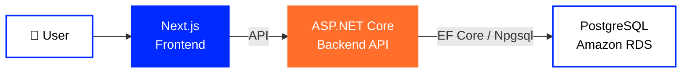

**🇬🇧 English** ·
[🇺🇦 Українська](https://github.com/tr3ba/.github/blob/main/profile/README.uk.md) ·
[🇷🇺 Русский](https://github.com/tr3ba/.github/blob/main/profile/README.ru.md)

  

# 🛒 Treba Marketplace

### Marketplace · Cloud Infrastructure · DevOps

A modern marketplace platform built with a strong focus on  
**cloud infrastructure, automation, security, monitoring and reliability**.

 

  

---

## 👋 About Treba

**Treba** is a modern full-stack marketplace built as a team project.

The platform combines a **Next.js frontend**, an **ASP.NET Core backend** and a
**PostgreSQL database**, supported by a real AWS cloud environment.

The engineering side of Treba goes beyond application development. The project includes
containerized deployment, automated CI/CD, cloud infrastructure, database recovery,
monitoring, access control and infrastructure security.

---

# 🧩 Core Technologies

<table>
<tr>

<td width="50%" valign="top">

<h3 align="center">🎨 Frontend</h3>

<table>
<tr>
<td width="85" align="center">

</td>
<td>
<strong>Next.js</strong> 
Main frontend framework powering the Treba web interface.
</td>
</tr>
</table>

 

<table>
<tr>
<td width="85" align="center">

</td>
<td>
<strong>React</strong> 
Component-based architecture for the marketplace user interface.
</td>
</tr>
</table>

 

<table>
<tr>
<td width="85" align="center">

</td>
<td>
<strong>TypeScript</strong> 
Typed frontend development for safer and more maintainable code.
</td>
</tr>
</table>

</td>

<td width="50%" valign="top">

<h3 align="center">⚙️ Backend</h3>

<table>
<tr>
<td width="85" align="center">

</td>
<td>
<strong>ASP.NET Core</strong> 
Main backend framework used for the Treba API and application services.
</td>
</tr>
</table>

 

<table>
<tr>
<td width="85" align="center">

</td>
<td>
<strong>.NET 8</strong> 
Runtime and development platform for backend services.
</td>
</tr>
</table>

 

<table>
<tr>
<td width="85" align="center">

</td>
<td>
<strong>Entity Framework Core</strong> 
Database access and model management for the backend.
</td>
</tr>
</table>

</td>

</tr>
</table>

---

# 🗄️ Data Layer

<table>
<tr>

<td width="50%" valign="top">

<table>
<tr>
<td width="90" align="center">

</td>
<td>
<strong>PostgreSQL</strong> 
Primary relational database used by the marketplace backend.
</td>
</tr>
</table>

</td>

<td width="50%" valign="top">

<table>
<tr>
<td width="90" align="center">

</td>
<td>
<strong>Amazon RDS</strong> 
Managed AWS database environment hosting PostgreSQL.
</td>
</tr>
</table>

</td>

</tr>
</table>

---

# ☁️ AWS & DevOps

<table>
<tr>

<td width="50%" valign="top">

<h3 align="center">🚀 Delivery & Runtime</h3>

<table>
<tr>
<td width="85" align="center">

</td>
<td>
<strong>Docker</strong> 
Containerized packaging for backend and frontend services.
</td>
</tr>
</table>

 

<table>
<tr>
<td width="85" align="center">

</td>
<td>
<strong>GitHub Actions</strong> 
Automated build, delivery and deployment workflows.
</td>
</tr>
</table>

 

<table>
<tr>
<td width="85" align="center">

</td>
<td>
<strong>Amazon ECR</strong> 
Container registry storing Treba backend and frontend images.
</td>
</tr>
</table>

 

<table>
<tr>
<td width="85" align="center">

</td>
<td>
<strong>Amazon EC2</strong> 
Cloud server running the application containers.
</td>
</tr>
</table>

</td>

<td width="50%" valign="top">

<h3 align="center">🛡️ Operations & Infrastructure</h3>

<table>
<tr>
<td width="85" align="center">

</td>
<td>
<strong>AWS Systems Manager</strong> 
Controlled remote deployment and command execution on EC2.
</td>
</tr>
</table>

 

<table>
<tr>
<td width="85" align="center">

</td>
<td>
<strong>Amazon CloudWatch</strong> 
Infrastructure monitoring and alarms for EC2 and RDS.
</td>
</tr>
</table>

 

<table>
<tr>
<td width="85" align="center">

</td>
<td>
<strong>AWS IAM</strong> 
Access control for automation, infrastructure and runtime services.
</td>
</tr>
</table>

 

<table>
<tr>
<td width="85" align="center">

</td>
<td>
<strong>AWS Secrets Manager</strong> 
Controlled storage and access for runtime secrets.
</td>
</tr>
</table>

</td>

</tr>
</table>

---

# 🏗️ System Architecture

The Treba application is separated into frontend, backend and database layers.

This separation allows each part of the system to be deployed, monitored and diagnosed
independently.

---

# 🚀 CI/CD Pipeline

```mermaid
flowchart LR

    DEV["Developer"]
    GH["GitHub"]
    ACTIONS["GitHub<br/>Actions"]
    DOCKER["Docker<br/>Build"]
    ECR["Amazon<br/>ECR"]
    SSM["AWS Systems<br/>Manager"]
    EC2["Amazon<br/>EC2"]

    DEV --> GH
    GH --> ACTIONS
    ACTIONS --> DOCKER
    DOCKER --> ECR
    ECR --> SSM
    SSM --> EC2

    style DEV fill:#ffffff,color:#000000,stroke:#002AFF,stroke-width:2px
    style GH fill:#ffffff,color:#000000,stroke:#002AFF,stroke-width:2px
    style ACTIONS fill:#002AFF,color:#ffffff,stroke:#002AFF,stroke-width:2px
    style DOCKER fill:#002AFF,color:#ffffff,stroke:#002AFF,stroke-width:2px
    style ECR fill:#FF6E2A,color:#ffffff,stroke:#FF6E2A,stroke-width:2px
    style SSM fill:#FF6E2A,color:#ffffff,stroke:#FF6E2A,stroke-width:2px
    style EC2 fill:#FF6E2A,color:#ffffff,stroke:#FF6E2A,stroke-width:2px
```

**GitHub → GitHub Actions → Docker → Amazon ECR → AWS Systems Manager → Amazon EC2**

Treba uses an automated delivery process instead of manually copying application files
to the server.

Changes enter the deployment pipeline through GitHub, Docker images are produced and
stored in Amazon ECR, and deployment commands are executed on EC2 through
AWS Systems Manager.

---

# ❤️ Runtime Health

<table>

<tr>
<td align="center" width="25%">

<strong>/ping</strong>

 

🟢

 

Backend process

</td>

<td align="center" width="25%">

<strong>/health</strong>

 

🟢

 

Backend + Database

</td>

<td align="center" width="25%">

<strong>PostgreSQL</strong>

 

🟢

 

RDS connectivity

</td>

<td align="center" width="25%">

<strong>/cart</strong>

 

🟢

 

Frontend route

</td>
</tr>

</table>

Different checks are used for different system layers.

`/ping` confirms that the backend process is responding, while `/health`
also verifies database connectivity.

---

# 🕓 Development Journey

<table>

<tr>
<td width="20%" align="center">

### 🌱 July

**Foundation**

</td>

<td>

GitHub organization, repositories, branch structure and the first team workflow were created.

`GitHub` · `Branches` · `Pull Requests` · `Review`

</td>
</tr>

<tr>
<td width="20%" align="center">

### 🐳 August

**Containers**

</td>

<td>

The project moved toward reproducible containerized environments and automated workflows.

`Docker` · `Docker Compose` · `GitHub Actions` · `CI/CD`

</td>
</tr>

<tr>
<td width="20%" align="center">

### ☁️ September

**AWS**

</td>

<td>

Backend and frontend received separate cloud delivery paths and the application moved into AWS.

`ECR` · `EC2` · `RDS` · `Systems Manager`

</td>
</tr>

<tr>
<td width="20%" align="center">

### 🛡️ October

**Operations**

</td>

<td>

The focus expanded from deployment to monitoring, recovery, infrastructure security and deeper testing.

`CloudWatch` · `IAM` · `Backups` · `Security`

</td>
</tr>

</table>

---

# 🔧 Real Problems. Real Fixes.

Treba was developed through real infrastructure problems rather than only a successful final deployment.

<table>

<tr>

<td width="50%" valign="top">

<h3>🐳 Docker Environment</h3>

<strong>Problem</strong>

Docker Desktop stopped providing a reliable local container environment.

  

<strong>Solution</strong>

The container workflow was moved to Docker Engine inside WSL Ubuntu.

</td>

<td width="50%" valign="top">

<h3>🔐 Backend Restart Loop</h3>

<strong>Problem</strong>

The backend image successfully built and reached the server, but the container restarted.

  

<strong>Diagnosis</strong>

Runtime configuration was missing the required JWT SecretKey.

  

<strong>Result</strong>

Configuration delivery was corrected and the backend deployment succeeded.

</td>

</tr>

<tr>

<td width="50%" valign="top">

<h3>🗄️ RDS Connectivity</h3>

<strong>Problem</strong>

Connections to PostgreSQL timed out during development.

  

<strong>Diagnosis</strong>

Network reachability, Security Groups and database connectivity were checked separately.

  

<strong>Result</strong>

The required network path was restored and later hardened.

</td>

<td width="50%" valign="top">

<h3>🛡️ Database Exposure</h3>

<strong>Problem</strong>

PostgreSQL port <code>5432</code> was temporarily opened broadly during diagnostics.

  

<strong>Result</strong>

The world-open rule was removed and backend connectivity was preserved through the required Security Group relationship.

</td>

</tr>

<tr>

<td width="50%" valign="top">

<h3>❤️ Health Checks</h3>

<strong>Problem</strong>

The old <code>/WeatherForecast</code> route no longer represented the real backend and returned <code>404</code>.

  

<strong>Solution</strong>

<code>/ping</code> became the application smoke check and <code>/health</code> became the database-aware health check.

</td>

<td width="50%" valign="top">

<h3>🌐 Frontend Deployment</h3>

<strong>Problem</strong>

A successful deployment did not always immediately match what appeared in the browser.

  

<strong>Diagnosis</strong>

GitHub Actions, ECR image, running container, HTTP response and browser cache were checked separately.

</td>

</tr>

</table>

---

# 📊 Monitoring & Recovery

<table>

<tr>

<td align="center" width="33%">

### 📈 CloudWatch

**6 infrastructure alarms**

EC2 and RDS monitoring

</td>

<td align="center" width="33%">

### 💾 Backups

**7-day retention**

Automated RDS backups

</td>

<td align="center" width="33%">

### ⏱️ PITR

**Point-in-Time Recovery**

Database recovery support

</td>

</tr>

<tr>

<td align="center">

### 📸 Snapshot

**Manual recovery point**

RDS snapshot verified

</td>

<td align="center">

### 💰 AWS Budget

**Cost monitoring**

Budget alerts configured

</td>

<td align="center">

### 🔐 IAM

**Scoped permissions**

Separate infrastructure access

</td>

</tr>

</table>

---

# 🔐 Security & Infrastructure

<table>

<tr>

<td width="50%">

### 🛡️ Network Security

- RDS Security Groups
- EC2 → RDS controlled access
- World-open PostgreSQL rule removed
- Runtime listener verification
- Restricted database access

</td>

<td width="50%">

### 🔑 Access & Secrets

- IAM roles
- Scoped AWS permissions
- AWS Secrets Manager
- Restricted runtime environment file
- GitHub branch protection

</td>

</tr>

<tr>

<td width="50%">

### 🔄 Delivery Security

- Pull Request workflow
- Required review
- CI/CD checks
- ECR image history
- SSM-based deployment

</td>

<td width="50%">

### 📡 Operations

- CloudWatch alarms
- Database backups
- Point-in-Time Recovery
- Manual snapshots
- Cost monitoring

</td>

</tr>

</table>

---

# 📦 Treba Repositories

<table>

<tr>

<td width="50%" align="center">

### ⚙️ Backend

ASP.NET Core backend API, application services and database access.

 

</td>

<td width="50%" align="center">

### 🎨 Frontend

Next.js marketplace interface and frontend deployment pipeline.

 

</td>

</tr>

</table>

---

# 🗺️ Roadmap

<table>

<tr>

<td width="33%" valign="top">

### ✅ Current

- AWS deployment
- Backend container
- Frontend container
- PostgreSQL / RDS
- GitHub Actions
- Amazon ECR
- AWS Systems Manager
- CloudWatch alarms
- Backups & PITR
- Security hardening

</td>

<td width="33%" valign="top">

### 🚧 Next

- HTTPS & domain
- Centralized application logs
- AWS OIDC for GitHub Actions
- Immutable deployments
- Tested rollback process
- Recovery drill
- Deeper end-to-end verification

</td>

<td width="33%" valign="top">

### 🔭 Future

- Infrastructure as Code
- Advanced observability
- Further security automation
- Automated recovery workflows
- Kubernetes when justified by project scale

</td>

</tr>

</table>

---

## Treba Marketplace

### Build · Automate · Deploy · Monitor · Improve

 

  

**Treba © 2026**

