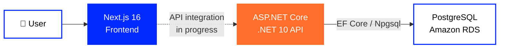

**🇬🇧 English** ·
🇺🇦 Українська *(coming soon)* ·
🇷🇺 Русский *(coming soon)*

  

# 🛒 Treba Marketplace

### Marketplace · Cloud Infrastructure · DevOps

A modern marketplace platform built with a strong focus on  
**cloud infrastructure, automation, security, monitoring and reliability**.

 

  

---

## 👋 About Treba

**Treba** is a team-built full-stack marketplace consisting of a modern web frontend,
a structured backend API and cloud infrastructure on AWS.

The backend provides marketplace APIs, authentication, authorization, user management,
catalog operations and database access.

The frontend delivers the marketplace interface and is actively being integrated with
the backend API.

The infrastructure layer provides containerized deployment, automated delivery,
monitoring, database recovery, access control and security hardening.

---

# 🧩 Core Technologies

<table width="100%">
<tr>

<td width="50%" valign="top">

### 🎨 Frontend

 

**Next.js 16.2.12**  
Frontend framework powering the Treba web interface.

  

**React 19.2.4**  
Component-based user interface architecture.

  

**TypeScript 5**  
Typed frontend development and application logic.

 

</td>

<td width="50%" valign="top">

### ⚙️ Backend

 

**ASP.NET Core · .NET 10**  
Main backend API and runtime platform.

  

**Entity Framework Core 10**  
ORM, database models and migrations.

  

**Npgsql**  
PostgreSQL provider used by the backend infrastructure layer.

 

</td>

</tr>
</table>

---

# 💻 Repository Languages

<table width="100%">
<tr>

<td width="50%" valign="top" align="center">

### ⚙️ Backend

C# backend with additional HTML/CSS from the AdminPanel and related UI files.

</td>

<td width="50%" valign="top" align="center">

### 🎨 Frontend

Next.js application written primarily in TypeScript and CSS.

</td>

</tr>
</table>

---

# 🗄️ Data Layer

<table width="100%">
<tr>

<td width="50%" align="center" valign="top">

### PostgreSQL

Primary relational database used by the backend.

Backend database access is implemented through  
**Entity Framework Core + Npgsql**.

</td>

<td width="50%" align="center" valign="top">

### Amazon RDS

Managed PostgreSQL environment used by the Treba AWS infrastructure.

</td>

</tr>
</table>

---

# ☁️ AWS & DevOps

## 🚀 Delivery & Runtime

<table width="100%">
<tr>

<td width="25%" align="center" valign="top">

### Docker

Containerized backend and frontend services.

</td>

<td width="25%" align="center" valign="top">

### GitHub Actions

Build, test and delivery automation.

</td>

<td width="25%" align="center" valign="top">

### Amazon ECR

Docker image registry for application builds.

</td>

<td width="25%" align="center" valign="top">

### Amazon EC2

Runtime host for deployed application containers.

</td>

</tr>
</table>

 

## 🛡️ Operations & Infrastructure

<table width="100%">
<tr>

<td width="25%" align="center" valign="top">

### Systems Manager

Remote deployment and command execution.

</td>

<td width="25%" align="center" valign="top">

### CloudWatch

Infrastructure monitoring and alarms.

</td>

<td width="25%" align="center" valign="top">

### IAM

Access control for automation and runtime services.

</td>

<td width="25%" align="center" valign="top">

### Secrets Manager

Controlled access to runtime secrets.

</td>

</tr>
</table>

---

# 🏗️ System Architecture

Treba consists of separate **frontend**, **backend API** and **database** layers.

The backend API and PostgreSQL data layer are implemented independently from the frontend.

> **Frontend integration status:** catalog, authentication and cart flows still contain
> local client-side data/state and are being connected to the backend API.

---

# 🚀 CI/CD Pipeline

```mermaid
flowchart LR

    DEV["Developer"]
    GH["GitHub"]
    ACTIONS["GitHub<br/>Actions"]
    TEST["Build<br/>& Tests"]
    DOCKER["Docker<br/>Image"]
    ECR["Amazon<br/>ECR"]
    SSM["AWS Systems<br/>Manager"]
    EC2["Amazon<br/>EC2"]

    DEV --> GH
    GH --> ACTIONS
    ACTIONS --> TEST
    TEST --> DOCKER
    DOCKER --> ECR
    ECR --> SSM
    SSM --> EC2

    style DEV fill:#ffffff,color:#000000,stroke:#002AFF,stroke-width:2px
    style GH fill:#ffffff,color:#000000,stroke:#002AFF,stroke-width:2px
    style ACTIONS fill:#002AFF,color:#ffffff,stroke:#002AFF,stroke-width:2px
    style TEST fill:#002AFF,color:#ffffff,stroke:#002AFF,stroke-width:2px
    style DOCKER fill:#002AFF,color:#ffffff,stroke:#002AFF,stroke-width:2px
    style ECR fill:#FF6E2A,color:#ffffff,stroke:#FF6E2A,stroke-width:2px
    style SSM fill:#FF6E2A,color:#ffffff,stroke:#FF6E2A,stroke-width:2px
    style EC2 fill:#FF6E2A,color:#ffffff,stroke:#FF6E2A,stroke-width:2px
```

**GitHub → GitHub Actions → Build & Test → Docker → ECR → SSM → EC2**

The repositories contain CI/CD workflows for:

**Backend**
- restore and build
- automated tests
- NuGet vulnerability checks
- Docker image build
- `/ping` container smoke check
- ECR image publishing
- SSM-based EC2 deployment
- versioned `v*` release workflow

**Frontend**
- Docker image build
- ECR publishing
- SSM-based EC2 deployment

---

# 🕓 Development Journey

<table width="100%">

<tr>
<td width="22%" align="center">

### 🌱 July

**Foundation**

</td>

<td>

GitHub organization, repositories, branch structure and the first team workflow were created.

`GitHub` · `Branches` · `Pull Requests` · `Review`

</td>
</tr>

<tr>
<td width="22%" align="center">

### 🐳 August

**Containers**

</td>

<td>

The project moved toward reproducible containerized environments and automated workflows.

`Docker` · `Docker Compose` · `GitHub Actions` · `CI/CD`

</td>
</tr>

<tr>
<td width="22%" align="center">

### ☁️ September

**AWS**

</td>

<td>

Backend and frontend received separate cloud delivery paths and the application moved into AWS.

`ECR` · `EC2` · `RDS` · `Systems Manager`

</td>
</tr>

<tr>
<td width="22%" align="center">

### 🛡️ October

**Operations**

</td>

<td>

The focus expanded from deployment to monitoring, recovery,
infrastructure security and deeper integration testing.

`CloudWatch` · `IAM` · `Backups` · `Security`

</td>
</tr>

</table>

---

# 📊 Monitoring & Recovery

Latest documented infrastructure checks from late September / early October 2026.

<table width="100%">

<tr>

<td align="center" width="33%">

### 📈 CloudWatch

**6 infrastructure alarms**

Verified in the latest monitoring audit.

</td>

<td align="center" width="33%">

### 💾 Automated Backups

**7-day retention**

Amazon RDS automated backups.

</td>

<td align="center" width="33%">

### ⏱️ PITR

**Point-in-Time Recovery**

Recovery to a selected point in time.

</td>

</tr>

<tr>

<td align="center">

### 📸 Manual Snapshot

**Available**

Manual recovery snapshot created and verified.

</td>

<td align="center">

### 💰 AWS Budget

**Alerts configured**

Development cost monitoring.

</td>

<td align="center">

### 🗄️ RDS Health

**Database connected**

Backend `/health` confirmed database connectivity.

</td>

</tr>

</table>

> Backup availability and a tested restore procedure are different things.
> A full restore drill is still a separate task.

---

# 🔐 Security & Infrastructure

<table width="100%">

<tr>

<td width="50%" valign="top">

### 🛡️ Network Security

- EC2 → RDS Security Group access
- World-open PostgreSQL `5432` rule removed
- RDS connectivity verified after hardening
- Actual EC2 listeners inspected
- Database access narrowed from temporary diagnostic exposure

</td>

<td width="50%" valign="top">

### 🔑 Access & Secrets

- IAM roles for AWS runtime access
- Scoped Secrets Manager access
- Runtime environment file restricted to mode `600`
- GitHub CI and EC2 runtime permissions separated
- AWS Systems Manager used for deployment

</td>

</tr>

<tr>

<td width="50%" valign="top">

### 🔄 Delivery Security

- GitHub Actions checks
- Docker image history in ECR
- SHA/version image tags
- SSM-based deployment path
- Backend dependency vulnerability check

</td>

<td width="50%" valign="top">

### 🚧 Open Hardening Tasks

- HTTPS / TLS
- Public backend port `5000`
- GitHub Actions → AWS OIDC
- Immutable deployment by digest / SHA
- Tested rollback procedure
- Centralized application logging

</td>

</tr>

</table>

---

# 📦 Treba Repositories

<table width="100%">
<tr>

<td width="50%" align="center" valign="top">

## ⚙️ Backend

### ASP.NET Core · .NET 10

Structured backend solution containing:

`Application` · `Contracts` · `Domain` · `Infrastructure` · `WebApi` · `AdminPanel`

 

Includes APIs for catalog, products, categories, brands, variants,
cart, sellers, stores, users and administration.

  

Authentication includes registration, login,
refresh/logout and two-factor authentication support.

  

  

  

</td>

<td width="50%" align="center" valign="top">

## 🎨 Frontend

### Next.js 16 · React 19

Modern marketplace user interface written primarily in TypeScript.

 

Includes catalog UI, navigation, product presentation,
authentication UI and cart functionality.

  

Backend API integration for catalog, authentication and cart
is still being developed.

  

  

  

</td>

</tr>
</table>

---

# Treba Marketplace

### Build · Automate · Deploy · Monitor · Improve

 

  

**Treba © 2026**

